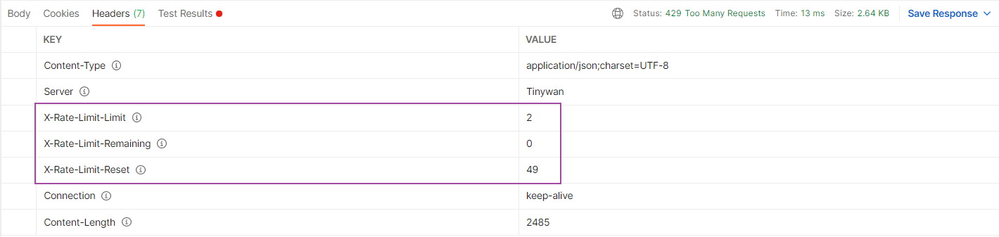

# based on lua script limiting traffic for webman plugin

[](https://packagist.org/packages/tinywan/limit-traffic) [](https://packagist.org/packages/tinywan/limit-traffic) [](https://packagist.org/packages/tinywan/limit-traffic) [](https://packagist.org/packages/tinywan/limit-traffic)

## 安装

```shell
composer require tinywan/limit-traffic
```

## 使用

### 应用中间件

在 `config/middleware.php` 中添加全局中间件如下：

```php
return [
    // 全局中间件
    '' => [
        // ... 这里省略其它中间件
        Tinywan\LimitTraffic\Middleware\LimitTrafficMiddleware::class,
    ],
    // api应用中间件
    'api' => [
        Tinywan\LimitTraffic\Middleware\LimitTrafficMiddleware::class,
    ]
];
```

### 路由中间件

> 注意：需要 `workerman/webman-framework` 版本 `>= 1.0.12`

我们可以给某个一个或某一组路由设置中间件。例如在 `config/route.php` 中添加如下配置：

```php
Route::any('/admin', [app\admin\controller\Index::class, 'index'])
->middleware([Tinywan\LimitTraffic\Middleware\LimitTrafficMiddleware::class]);

// 分组路由
Route::group('/blog', function () {
   Route::any('/create', function () {return response('create');});
})->middleware([Tinywan\LimitTraffic\Middleware\LimitTrafficMiddleware::class]);
```

## ⚠ 请求限制参考



## 🔰 响应参数详解

- `X-Rate-Limit-Limit` 同一个时间段所允许的请求的最大数目
- `X-Rate-Limit-Remaining` 在当前时间段内剩余的请求的数量
- `X-Rate-Limit-Reset` 为了得到最大请求数所等待的秒数

## Other

```php
vendor/bin/phpstan analyse src

vendor/bin/php-cs-fixer fix src
```